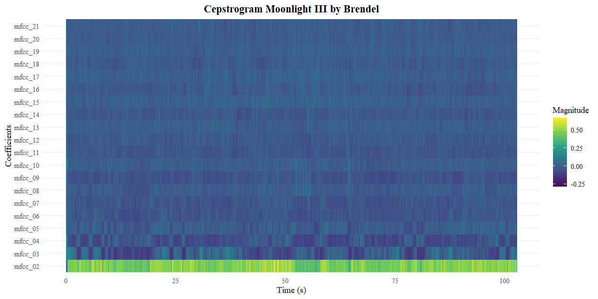
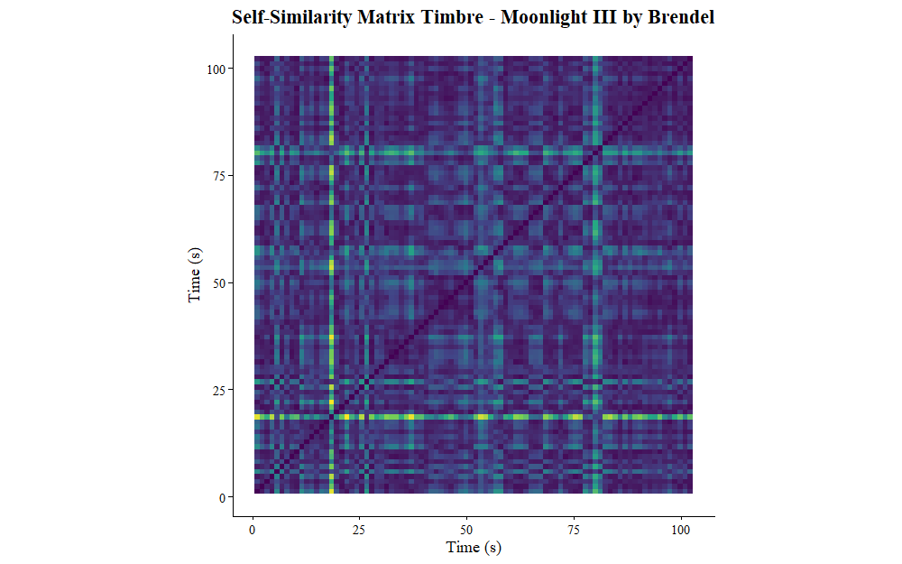

# Computational Musicology Portfolio - Mikayla van den Berg

My corpus consists of several recordings of Beethoven’s sonatas no.’s 8 (Pathétique), 14 (Moonlight) and 21 (Waldstein). 
These recordings span from the 60s to very recent ones from 2025.

## Cepstrogram

I have made a cepstrogram of a performance by Brendel of the 3rd movement of sonata no. 14. 

*Cepstrogram of Beethoven's Moonlight Sonata, 3rd movement. 
Performance by Brendel. Normalisation: Manhattan*

As the name suggests, a piano sonata is played by one instrument, so not much variation is visible
on the cepstrogram.

## Chromagram

I have also made a chromagram of a performance by Burchbinder of the first movement of sonata no. 8.

*Chromagram of Beethoven's Pathétique Sonata (No. 8), 1st movement. 
Perfomance by Buchbinder. Normalisation: Chebyshev*

This piece is in c-minor and starts with the c-minor chord (C-E♭-G). Looking at the chromagram overall, it doesn’t become immediately clear that the piece is in c-minor. 
However, the beginning does have a high magnitude on the note C. The C also becomes more prominent at the end of the piece.
During the rest of the piece, the E♭ is also being emphasized a lot, especially around 150 seconds.
This is when the piece switches to the key e♭-minor (during the second subject). Shortly after it also modulates to E-major, hence the strong magnitude.

## Self-Similarity Matrices

Below are two Self-Similarity Matrices (SSM) of a performance by Brendel of the first movement of sonata no 14.
The first one is based on timbre and the second one on pitch.

*Self-similarity matrix based on timbre of Beethoven's Moonlight Sonata (No. 14), 3rd movement. 
Performance by Brendel. Normalisation: Euclidean. Distance: cosine.*

*Self-similarity matrix based on pitch of Beethoven's Moonlight Sonata (No. 14), 3rd movement. 
Performance by Brendel. Normalisation: Euclidean. Distance: cosine.*

As mentioned before, the only instrument in the piece is a piano. That is why the SSM based on pitch
looks unvarying (apart from the dark blue diagonal). There are, however, some yellow lines visible.

The SSM based on pitch looks much different. To get more details, I reduced the 
downsampling from every 50th frame (as in the SSM based on timbre) to every 10th frame.
In comparison to the SSM based on timbre, there is a lot of variety in this one. This was also apperent from 
the chromagram, as explained above. *[Explanation of the blocks and lines, corresponding to the expo, develop, recap]*
