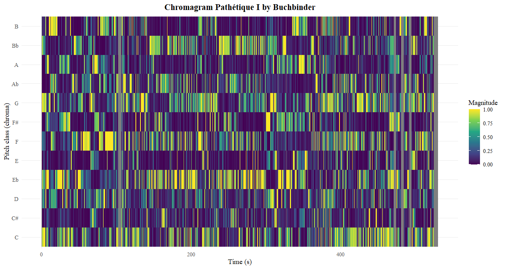
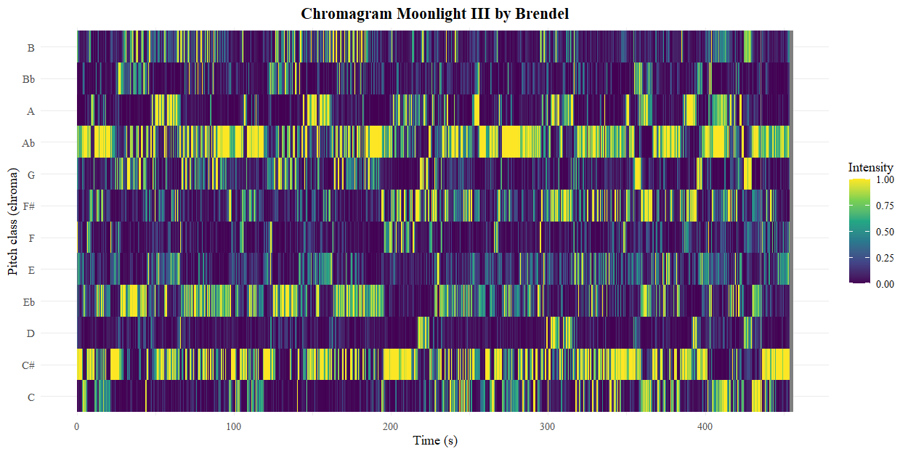
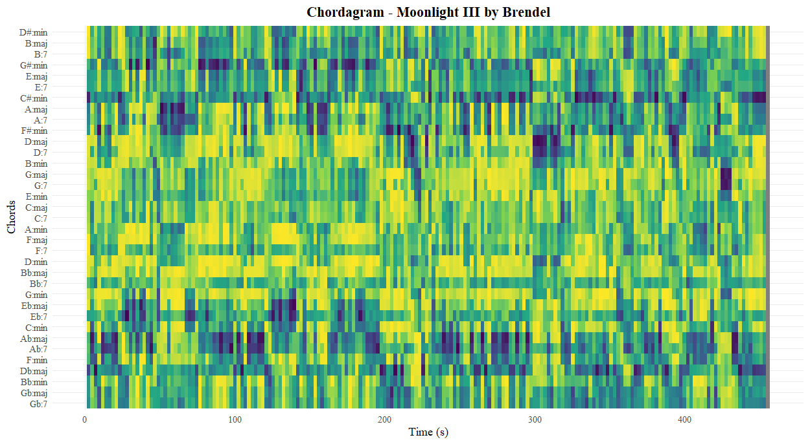
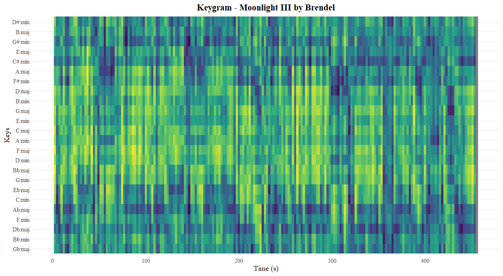
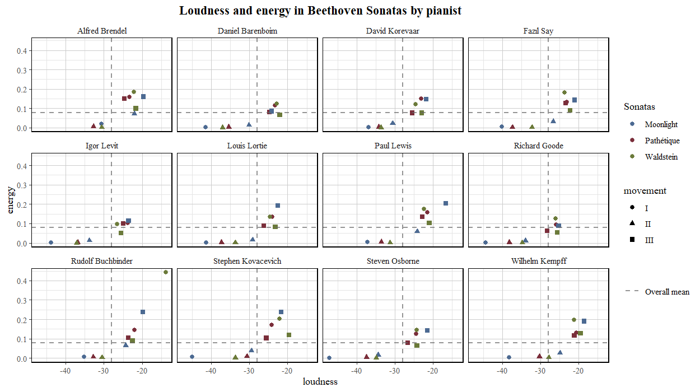
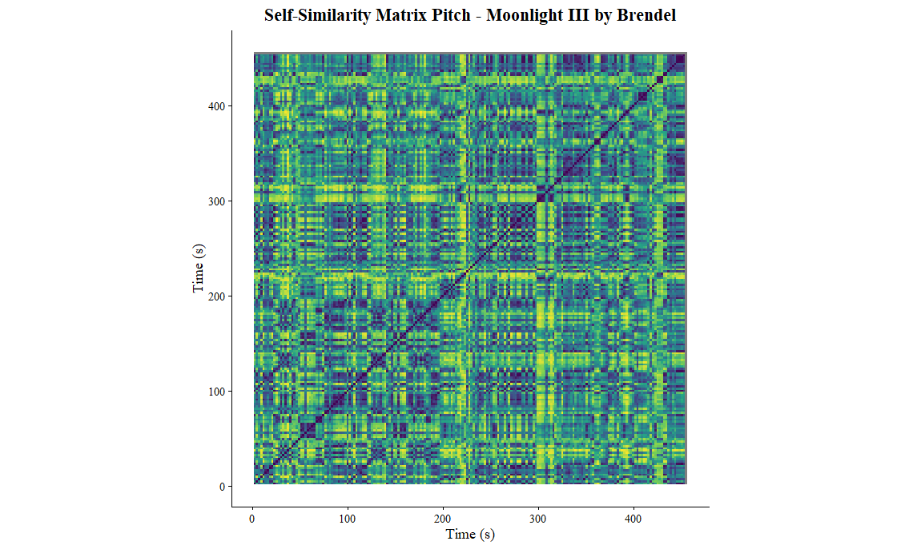

# Corpus description

Welcome to my online portfolio for Computational Musicology. I have compiled a corpus of several recordings of Ludwig van Beethoven’s sonatas no.’s 8 (Pathétique), 14 (Moonlight) and 21 (Waldstein). These are some of the most famous piano works of Beethoven and even of Western music history. That is why these works have been interpreted many times. Thus, the recordings span from the 60s to very recent ones from 2025.

## Column {width="40%"}

**Recordings** 
•	Brendel: 60s (?) 
•	Barenboim: 80s 
•	Buchbinder: 80s 
•	Lortie: 90s 
•	Kempff: 90s 
•	Goode: 90s 
•	Kovacevich: 2000s (?) 
•	Lewis: 2000s 
•	Osborne: 2010s 
•	Levit: 2010s 
•	Say: 2010s (release march 2020) 
•	Korevaar: 2020s 

# Chromagram 

*Chromagram of Beethoven's Pathétique Sonata (No. 8), 1st movement. 
Perfomance by Buchbinder. Normalisation: Chebyshev*

*Chromagram of Beethoven's Moonlight Sonata (No. 14), 3rd movement. 
Perfomance by Brendel. Normalisation: Chebyshev*

### Row {height="20%"}

I have made a chromagram of a performance by Burchbinder of the first movement of sonata no. 8 and also a chromagram of a perfomance by Brendel of the third movement of sonata 14.

Sonata no. 8 is in c-minor and starts with the c-minor chord (C-E♭-G). Looking at the chromagram overall, it doesn’t become immediately clear that the piece is in c-minor. 
However, the beginning does have a high magnitude on the note C. The C also becomes more prominent at the end of the piece.
During the rest of the piece, the E♭ is also being emphasized a lot, especially around 150 seconds.
This is when the piece switches to the key e♭-minor (during the second subject). Shortly after it also modulates to E-major, hence the strong magnitude.

In the chromagram of sonata no. 14 it's more apparent that the piece is in c♯-minor, because there is a lot of emphasis on this pitch class. Surprisingly, there is also a high intensity on A♭. This becomes less strange when one remembers that A♭ and G♯ are enharmonically equivalent. G♯ is the dominant (V) of c♯-minor and thus very important. Chromagrams measure pitch energy, not tonal function, so the dominant can easily appear stronger than the tonic.

Key- and chordagrams *do* try to capture tonal function, so it is good to take a look at those.

# Key- and chordagrams

*Chordagram of Beethoven's Moonlight Sonata (No. 14), 3rd movement. 
Perfomance by Brendel. Normalisation: Chebyshev*

*Keygram of Beethoven's Moonlight Sonata (No. 14), 3rd movement. 
Perfomance by Brendel. Normalisation: Chebyshev*

## Column {width="40%"}

On the left are a chordagram and a keygram of a performance by Brendel of the 3rd movement of sonata no. 14. The chordagram shows which chord templates best matches the chroma pattern and the keygram shows which key template best matches the chroma pattern. Blue means there is a high similarity.

The pattern of the chordagram is quite similar to the chromagram. There is high similarity between the templates for c♯-minor, c♯-minor and D♭-major during the whole piece and A♭-major(7) and E♭-major(7) at certain moments. There is also a dark blue spot for D-maj(7) later in the piece. The constant dark band for c♯-minor is exactly what we expect, because the chroma vectors frequently contain the tonic triad tones: C♯–E–G♯. G♯-minor also appears strong because it shares one note with the tonic triad and the dominant is stronlgy emhpasized throughout the piece. D♭-major is the enharmonic spelling of C♯-minor, so that is why this also appears often in the chordagram. A♭-major(7) and E♭ major(7) appear because pitch collections associated with the dominant function can resemble these chord templates in the chroma representation. Something that strengthes these effects is that the piece contains a lot of fast arpeggios: the movement is full of broken chords, so each analysis frame may contain only partial chord tones.

# Graphs

# Self-Similarity Matrix

### Row {heigh="20%"}

This is a Self-Similarity Matrices (SSM) of a performance by Brendel of the first movement of sonata no 14, based on pitch.

This piece is in c♯-minor and in sonata form, which means that the exposition get's repeated. 
This happens at around a 100 seconds and a (faint) blue diagonal line is visible at this point in the SSM. 
The entirety of the exposition is visible as a block-like structure around 215 seconds (with a yellow outline). 
Here the second theme sounds in f♯-minor, which is different from the exposition where it was in g♯-minor.

There is not a block-like structure visible for the entirety of the development, which ends at around 265 seconds. 
At this point the recapitulation starts with the first subject remaining unaltered. The second subject is now in the tonic (instead of g♯-minor as in the exposition).

The overall SSM has a lot of block-like structures, but these are not easy to distinguish from each other and they cannot easily be linked to what is audible in the audio. 
The reason for this, is that piano sonatas in sonata form are build on themes and motives that get repeated but could also get slightly altered. 
Thus, there is a lot of homogeneity.

------------------------------------------------------------------------
