# Corpus

```{r}
htmltools::HTML('

<strong style="font-size: 20px;">Beethoven\'s Piano Sonatas: Several interpretations</strong>

<p>Welcome to my online portfolio for Computational Musicology 2026. For my corpus of music I have compiled several recordings of Ludwig van Beethoven\'s sonatas no.\'s 8 (<b>Pathétique</b>), 14 (<b>Moonlight</b>) and 21 (<b>Waldstein</b>). These are some of the most famous piano works of Beethoven and even of Western music history. Thus, these works have been interpreted many times.</p>

<strong>Corpus description</strong>

<p>The various pianists can be seen on the right side, with a link to a playlist on Spotify containing the recordings below it. I was already familiar with some of the interpreters in my corpus, for instance Alfred Brendel, Daniel Barenboim and Paul Lewis. However, I also included interpretations by performers that were new to me, like Richard Goode and Steven Osborne. I chose these recordings because they span a wide range, from the 1960s to very recent ones from 2025*.</p>

<strong>This storyboard</strong>

<p>This analysis will focus on the different interpretations by the various pianists included in the corpus. First, the tracks will be analysed more broadly, using Spotify-derived track-level features of the various interpretations. Following that, selected performances will be examened in greater detail using chroma, timbre and temporal features. Finally, the analysis will zoom out again and see if meaningful clusters can be generated.<br> 
In the following analyses, the sonatas will be referred to by their well-known names: Pathétique, Moonlight and Waldstein. The movements will be indicated by Roman numerals: I, II or III directly after the name.</p>

<p style="position: absolute; bottom: 8px; font-size: 15px; color: #888;">*There is some ambiguity with the recording dates of some interpretations (as indicated by the question mark). However, this is not a big problem, since this corpus analysis will not focus on the effects of improving recording technologies for which it is important to know the exact dates.</p>

')
```

## Row {width="40%"}

```{r}
htmltools::HTML('
<strong>Recordings</strong>
<table style="width: 100%; font-size: 14px; border-collapse: collapse;">
  <tr>
    <td style="padding: 5px 0 5px 8px; border-bottom: 1px solid #eee;">Brendel</td>
    <td style="text-align: right; padding: 5px 8px 5px 0; border-bottom: 1px solid #eee;">
      <span style="background: #f5e6ea; color: #972717; padding: 2px 8px; border-radius: 99px; font-size: 12px;">60s (?)</span>
    </td>
  </tr>
  <tr>
    <td style="padding: 5px 0 5px 8px; border-bottom: 1px solid #eee;">Barenboim</td>
    <td style="text-align: right; padding: 5px 8px 5px 0; border-bottom: 1px solid #eee;">
      <span style="background: #f5e6ea; color: #972717; padding: 2px 8px; border-radius: 99px; font-size: 12px;">80s</span>
    </td>
  </tr>
  <tr>
    <td style="padding: 5px 0 5px 8px; border-bottom: 1px solid #eee;">Buchbinder</td>
    <td style="text-align: right; padding: 5px 8px 5px 0; border-bottom: 1px solid #eee;">
      <span style="background: #f5e6ea; color: #972717; padding: 2px 8px; border-radius: 99px; font-size: 12px;">80s</span>
    </td>
  </tr>
  <tr>
    <td style="padding: 5px 0 5px 8px; border-bottom: 1px solid #eee;">Lortie</td>
    <td style="text-align: right; padding: 5px 8px 5px 0; border-bottom: 1px solid #eee;">
      <span style="background: #f5e6ea; color: #972717; padding: 2px 8px; border-radius: 99px; font-size: 12px;">90s</span>
    </td>
  </tr>
  <tr>
    <td style="padding: 5px 0 5px 8px; border-bottom: 1px solid #eee;">Kempff</td>
    <td style="text-align: right; padding: 5px 8px 5px 0; border-bottom: 1px solid #eee;">
      <span style="background: #f5e6ea; color: #972717; padding: 2px 8px; border-radius: 99px; font-size: 12px;">90s</span>
    </td>
  </tr>
  <tr>
    <td style="padding: 5px 0 5px 8px; border-bottom: 1px solid #eee;">Goode</td>
    <td style="text-align: right; padding: 5px 8px 5px 0; border-bottom: 1px solid #eee;">
      <span style="background: #f5e6ea; color: #972717; padding: 2px 8px; border-radius: 99px; font-size: 12px;">90s</span>
    </td>
  </tr>
  <tr>
    <td style="padding: 5px 0 5px 8px; border-bottom: 1px solid #eee;">Kovacevich</td>
    <td style="text-align: right; padding: 5px 8px 5px 0; border-bottom: 1px solid #eee;">
      <span style="background: #f5e6ea; color: #972717; padding: 2px 8px; border-radius: 99px; font-size: 12px;">2000s (?)</span>
    </td>
  </tr>
  <tr>
    <td style="padding: 5px 0 5px 8px; border-bottom: 1px solid #eee;">Lewis</td>
    <td style="text-align: right; padding: 5px 8px 5px 0; border-bottom: 1px solid #eee;">
      <span style="background: #f5e6ea; color: #972717; padding: 2px 8px; border-radius: 99px; font-size: 12px;">2000s</span>
    </td>
  </tr>
  <tr>
    <td style="padding: 5px 0 5px 8px; border-bottom: 1px solid #eee;">Osborne</td>
    <td style="text-align: right; padding: 5px 8px 5px 0; border-bottom: 1px solid #eee;">
      <span style="background: #f5e6ea; color: #972717; padding: 2px 8px; border-radius: 99px; font-size: 12px;">2010s</span>
    </td>
  </tr>
  <tr>
    <td style="padding: 5px 0 5px 8px; border-bottom: 1px solid #eee;">Levit</td>
    <td style="text-align: right; padding: 5px 8px 5px 0; border-bottom: 1px solid #eee;">
      <span style="background: #f5e6ea; color: #972717; padding: 2px 8px; border-radius: 99px; font-size: 12px;">2010s</span>
    </td>
  </tr>
  <tr>
    <td style="padding: 5px 0 5px 8px; border-bottom: 1px solid #eee;">Say</td>
    <td style="text-align: right; padding: 5px 8px 5px 0; border-bottom: 1px solid #eee;">
      <span style="background: #f5e6ea; color: #972717; padding: 2px 8px; border-radius: 99px; font-size: 12px;">2010s</span>
    </td>
  </tr>
  <tr>
    <td style="padding: 5px 0 5px 8px;">Korevaar</td>
    <td style="text-align: right; padding: 5px 8px 5px 0;">
      <span style="background: #f5e6ea; color: #972717; padding: 2px 8px; border-radius: 99px; font-size: 12px;">2020s</span>
    </td>
  </tr>
</table>

  <iframe src="https://open.spotify.com/embed/playlist/3C9JMFOYExaderqntPLGJ1?si=3551c12b7ab84baa&pt=d6bcc49ab1e851589ad69f6928fd4429"
    width="100%" height="152" frameborder="0"
    allow="autoplay; clipboard-write; encrypted-media; fullscreen; picture-in-picture"
    loading="lazy">
  </iframe> 

')
```
# Loudness and energy

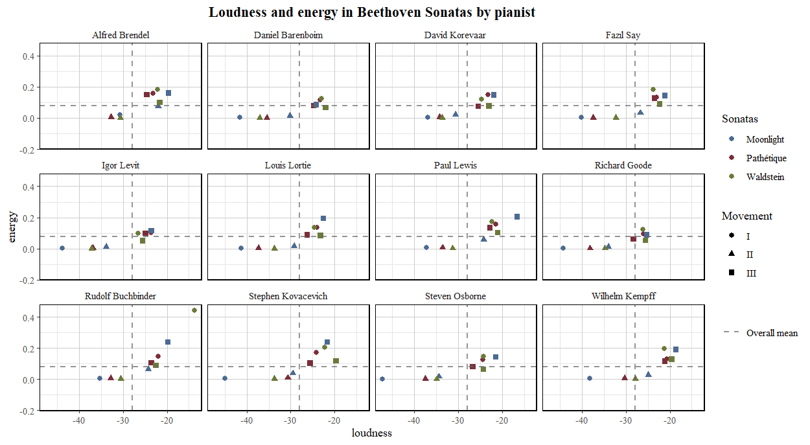
*Loudness and energy in sonata Pathétique (No. 8), Moonlight (No 14) and Waldstein (No. 21) per pianist.*

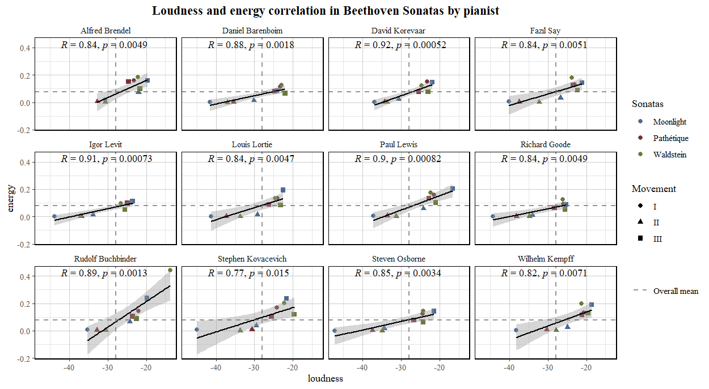
*Loudness and energy correlation in sonata Pathétique (No. 8), Moonlight (No 14) and Waldstein (No. 21) per pianist. per pianist.*

## Row {width="40%"}

```{r}
htmltools::HTML('
<strong>Loudness and energy</strong>

<p>Spotify provides features of tracks that can be analysed. For example, tracks can be described by \'energy\', \'happiness\' and \'acousticness\'. In the plot on the left, the various recordings by the pianists are plotted by loudness and energy. The different sonatas are indicated by colour and the movements by shape.<br>

Something that becomes immediately clear is that third movements are often on the right side of the plot, meaning they are higher in energy and loudness, whereas first movements are commonly on the left side. This corresponds to the standard sonata form, in which the final movements are often more energetic and fastpaced.<br>

Something else that stands out is the interpretation of the first movement of the Waldstein sonata by Buchbinder, which has a very high energy and loudness value. However, this does not become apparent from the audio, which sounds just as loud as, for example, Kempff\'s and Goode\'s interpretation. Another interesting thing to note is that Lewis\' interpretations are overall more energetic and loud, compared to the other pianists (especially his interpretation of the third movement of the Moonlight sonata). In addition, Kovacevich\'s plot shows strong contrast between movements, because there is much spread between them. This is different for Korevaar, where the data points are more clustered and lying more to the mean. That means that Korevaar has a more uniform interpretation.<br>

Furthermore, across almost all pianists the first movement of sonata Moonlight has the lowest energy and is the quietest. This correponds to the sound of the piece: it sounds very introspective and dark. Thus, these Spotify features capture this very well. For some pianists this piece even becomes an outlier (Osborne, Kovacevich). The only interpretation of this movement that does not have the lowest value in energy and loudness compared to other pieces and movements is by Brendel. When comparing this version to Kovacevhich\'s, which has very low values for this movement, it becomes clear that Brendels version is much louder. This does not, however, cause Brendels interpretation of the first movement of sonata Moonlight to be much higher in energy compared to other interpretations. Still, there is a positive correlation between loudness and energy, although it is not perfectly linear.<br> 
In the plot below, the correlation and significance is calculated between the two values across all  movements and sonatas per pianist. The correlation for Korevaar is the strongest, with a R-value of 0.92 (1 being a perfect linear relationship). It is the lowest for Kovacevich, where the R-value is 0.77. However, this still indicates a strong relationship.</p>

')
```

# Chromagram


*Chromagram of the Pathétique sonata (No. 8), 1st movement. Perfomance by Buchbinder. Normalisation: Chebyshev*

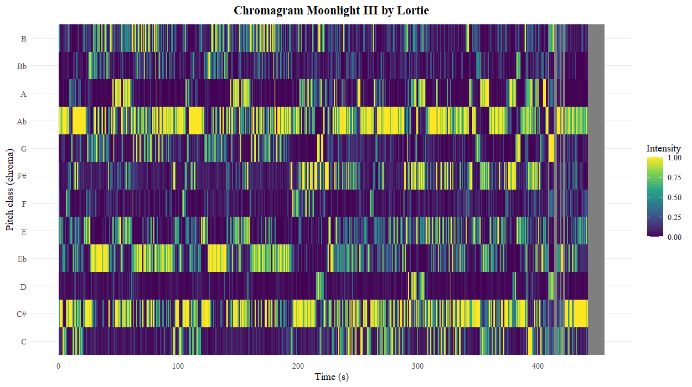
*Chromagram of the Moonlight sonata (No. 14), 3rd movement. Perfomance by Lortie. Normalisation: Chebyshev*

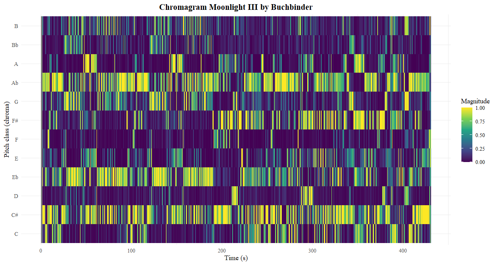
*Chromagram of the Moonlight sonata (No. 14), 3rd movement. Perfomance by Buchbinder. Normalisation: Chebyshev*

## Row {width="40%"}

```{r}
htmltools::HTML('

<strong>Chromagram</strong>

<p>On the left are three chromagrams. The first is the first movement of sonata Pathétique, performanced by Burchbinder. The second and third are the third movement of the Moonlight sonata, performed by Lorti and Buchbinder.<br>
Sonata Pathétique is in c-minor and starts with the c-minor chord (C-E♭-G), which is visible in the chromagram. Looking at the chromagram overall, it doesn’t become immediately clear that the piece is in c-minor. However, the beginning does have a high magnitude on the note C. The C also becomes more prominent at the end of the piece. During the rest of the piece, the E♭ is also being emphasized a lot, especially around 150-200 seconds. This is when the piece switches to the key e♭-minor (during the second subject). Shortly after it also modulates to E-major, hence the strong magnitude. The grey bands around 100 seconds is due to a quaver and quarter rest.<br>

The next chromagrams are of the third movement of the Moonlight sonata, performed by Lortie and Buchbinder. Here, it is more apparent that the piece is in c♯-minor, because there is a lot of emphasis on this pitch class. Surprisingly, there is also a high intensity on A♭. This becomes less strange when one remembers that A♭ and G♯ are enharmonically equivalent. G♯ is the dominant (V) of c♯-minor and thus very important.<br>

I chose these two performances because when listening, it sounds like the tuning of the piano is slighty off between them. However, this does not become very apparent from the chromagrams, because there is no energy \'bleeding\' into other chroma bins. This means the difference in tuning is likely a few cents, which a chromagram does not pick up.<br>
<br>
Chromagrams measure pitch energy and not tonal function, so the dominant can easily appear stronger than the tonic. Key- and chordagrams <i>do</i> try to capture tonal function, so it is good to take a look at those.
</p>

')
```

# Chordo- and keygram

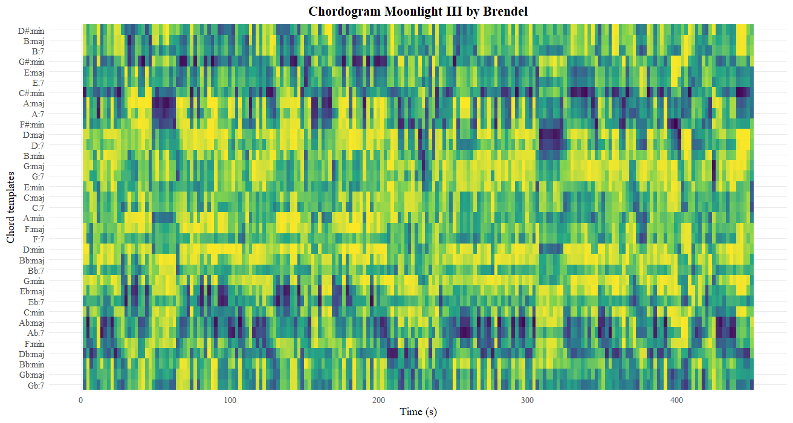 
*Chordogram of the Moonlight sonata (No. 14), 3rd movement. Perfomance by Brendel, using Temperley's (1999) templates. Normalisation: Chebyshev.*

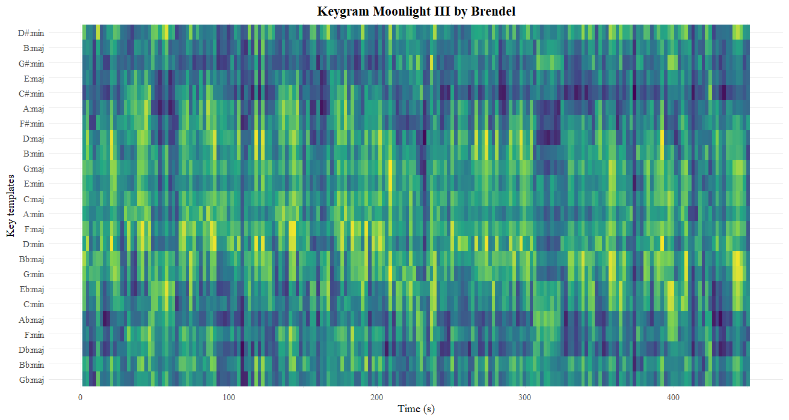 
*Keygram of the Moonlight sonata (No. 14), 3rd movement. Perfomance by Brendel, using Temperley's (1999) templates. Normalisation: Chebyshev*

## Row {width="40%"}

```{r}
htmltools::HTML('

<strong>Chordo- and keygram</strong>

On the left are a chordagram and a keygram of the third movement of sonata Moonlight, performaned by Brendel. The chordagram shows which chord templates best matches the chroma pattern and the keygram shows which key template fits best. Blue means there is a high similarity.<br>

The pattern of the chordagram is quite similar to the chromagram. There is high similarity between the templates for c♯-minor, g♯-minor and D♭-major during the whole piece and A♭-major(7) and E♭-major(7) at certain moments. There are also a dark blue spots for A-maj(7) and D-maj(7). The constant dark band for c♯-minor is exactly what we would expect. As mentioned before, the piece is in c♯-minor. Therefore, the chroma vectors frequently contain the tonic triad tones: C♯–E–G. G♯-minor also appears strong because it is the dominant of c♯-minor.Furthermore, around 30 seconds the piece modulates to g♯-minor. Around this time, the band for the g#-minor chord template becomes stronger. Around 100 seconds it modulates back to c♯-minor and the exposition is repeated, which is also illustrated in the chordogram. Around 215 seconds the piece modulates to f♯-minor. This is indicated by the increase in similarity for the f♯-minor template at that time.<br>

D♭-major most likely appears because of the pitch-class overlap with c♯-minor. Chroma features ignore spelling, so the C♯ and G♯ in a c♯-minor chord can be seen as, respectively, D♭ and F, which are in a D♭-major chord. This effect is being amplified by the fast arpeggios: the movement is full of broken chords, so each analysis frame may contain only partial chord tones. A similar thing is happening for the A♭-major(7) and E♭-major(7) chords.Also, the arpeggios are probably the reason why the chordo- and keygram are both very unstable. The strong blue spots around 50 and 300 seconds are due to arpeggios stopping briefly and the notes being played together. It is therefore easy to match the chord templates at these moments.<br>

The keygram is less clear than the chordogram, but they show similar trends. It becomes clear that the key templates c♯-minor, g♯-minor, D♭-major and A♭-major match the chroma vectors the most throughout the piece, but it does not become apparent from the keygram alone which of these is the main key. Something interesting about this movement is that it deviates from the usual sonata from. It is common for the second theme to be in the relative major key, but that is not the case here. Here the second theme is in g♯-minor, as mentioned before. This means that the piece does not shift to a major key. This in turn, however, does not mean that there are no major chords used, as is visible in the chordogram.<br>
<br>
Harmony plays a big role in the overall structure of a piano sonata, as already mentioned briefly. A Self-Similarity Matrix visualises this better.

')
```

# SSM and DTW

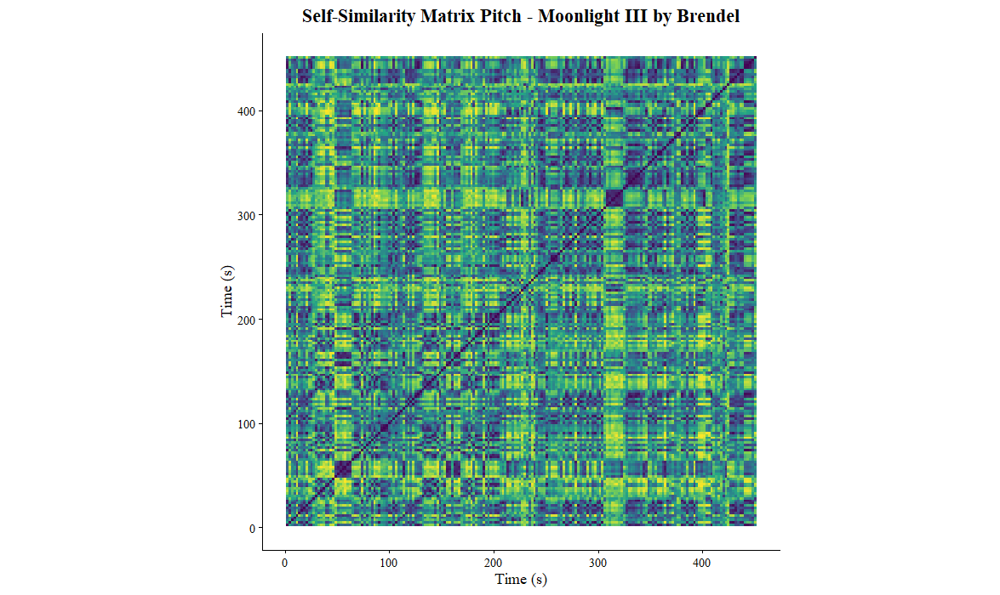 
*Self-similarity matrix based on pitch of the Moonlight Sonata (No. 14), 3rd movement. Performance by Brendel. Normalisation: Euclidean. Distance: cosine.*

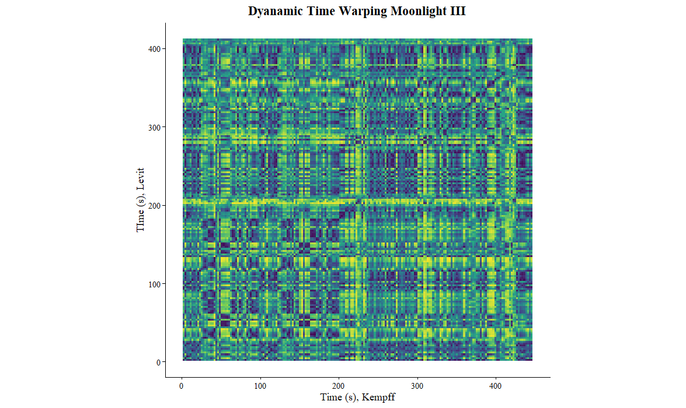

*Dynamic Time Warping based of the Moonlight Sonata (No. 14), 3rd movement. Performance by Kempff (x-axis) and Levit (y-axis) Normalisation: Euclidean. Distance: cosine.*

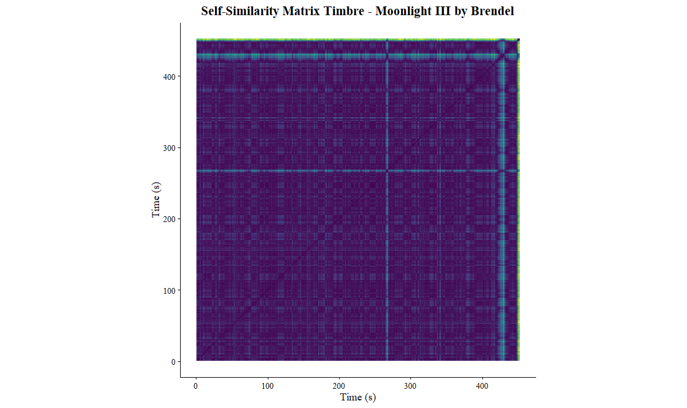 
*Self-similarity matrix based on timbre of the Moonlight Sonata (No. 14), 3rd movement. Performance by Brendel. Normalisation: Euclidean. Distance: cosine.*

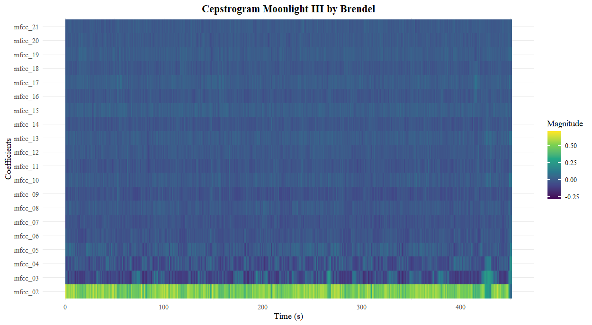
*Cepstrogram of the Moonlight Sonata (No. 14), 3rd movement. Performance by Brendel. Normalisation: Manhattan.*

## Row {width="40%"}

```{r}
htmltools::HTML('

<strong>Self-Similarity Matrix and Dynamic Time Warping</strong>

On the left are two Self-Similarity Matrices (SSM) of the performance by Brendel of the third movement of sonata Moonlight, based on pitch and timbre. Below the SSM based on pitch, a Dynamic Time Warping (DTW) can be seen of the third movement of sonata Moonlight, performanced by Kempff and Levit. I choese these two interpretations, because when listening to them, it sounds like Levit plays it much faster.<br>

This piece is in c♯-minor and in sonata form (as mentioned before), which means that the exposition get\'s repeated. This happens at around 100 seconds into the piece and a (faint) blue diagonal is visible at this point in the SSM based on pitch. The entirety of the exposition is visible as a block-like structure around 215 seconds (with a yellow outline). Here the second theme sounds in f♯-minor, which is different from the exposition, where it was in g♯-minor.<br>
There is no block-like structure visible for the entirety of the development, which ends at around 265 seconds. At this point the recapitulation starts with the first subject remaining unaltered. The second subject is now in the tonic (instead of g♯-minor as in the exposition).<br>

The overall SSM has a lot of block-like structures, but these are not easy to distinguish from each other and they cannot easily be linked to what is audible in the audio. The reason for this, is that piano sonatas in sonata form are build on themes and motives that get repeated but could also get slightly altered. Thus, there is a lot of homogeneity, but also variation. In addition, this piece consists mainly of fast arpeggios and listening to the piece gives the impression that everything flows together organically and there are few contrasting parts.<br>

The Dynamic Time Warping does not, on first glance, look that much different from the SSM. However, looking at it a bit longer reveals that the main diagonal is less cleary defined. You can also see that the performance by Kempff is indeed longer, so he does play the piece slower than Levit. A tempogram of both performances might reveal more about exactly how fast both pianists play this piece.<br>

When looking at the SSM based on timbre, it becomes apparent that there is a lot of homogeneity. This is exactly what we would expect, for a piano sonata only has one instrument. The faint light blue line around 260 seconds is due to rests in the piece. This is also true for the light blue and yellow lines at the end. The cepstrogram below corroborates these insights.

')
```

# Tempogram

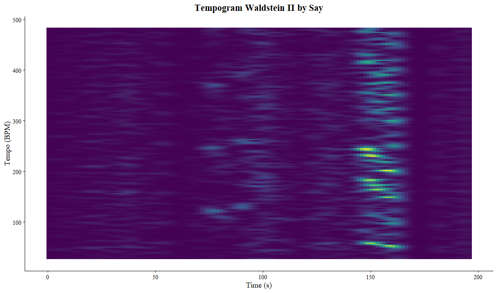 
*Tempogram of the Waldstein sonata (No. 21), 2nd movement, Perfomance by Say. Fourier-based.*

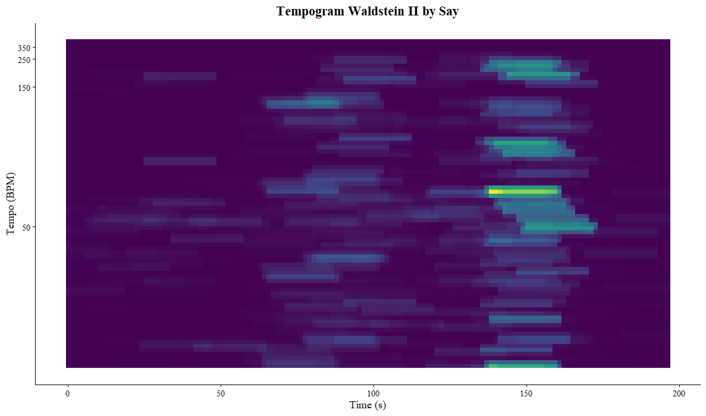 
*Tempogram of the Waldstein sonata (No. 21), 2nd movement, Perfomance by Say. Autocorrelation based.*

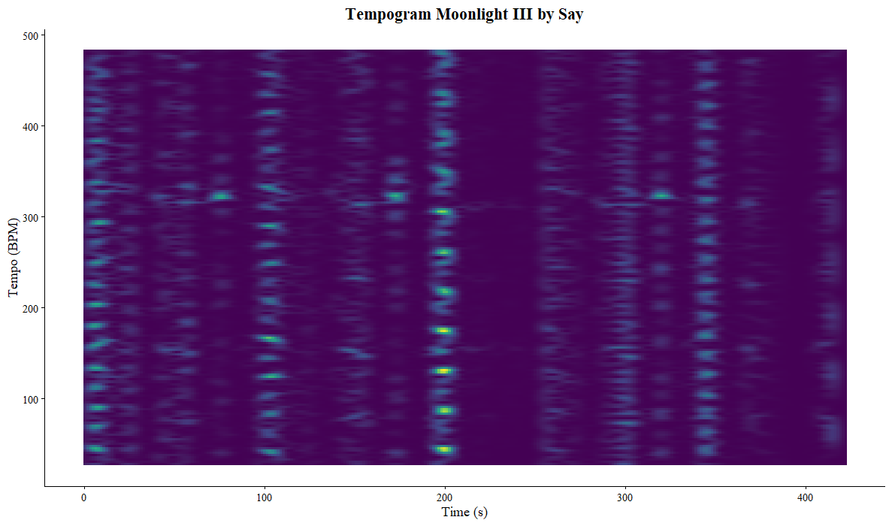 
*Tempogram of the Moonlight sonata (No. 14), 3rd movement, Perfomance by Say. Fourier-based.*

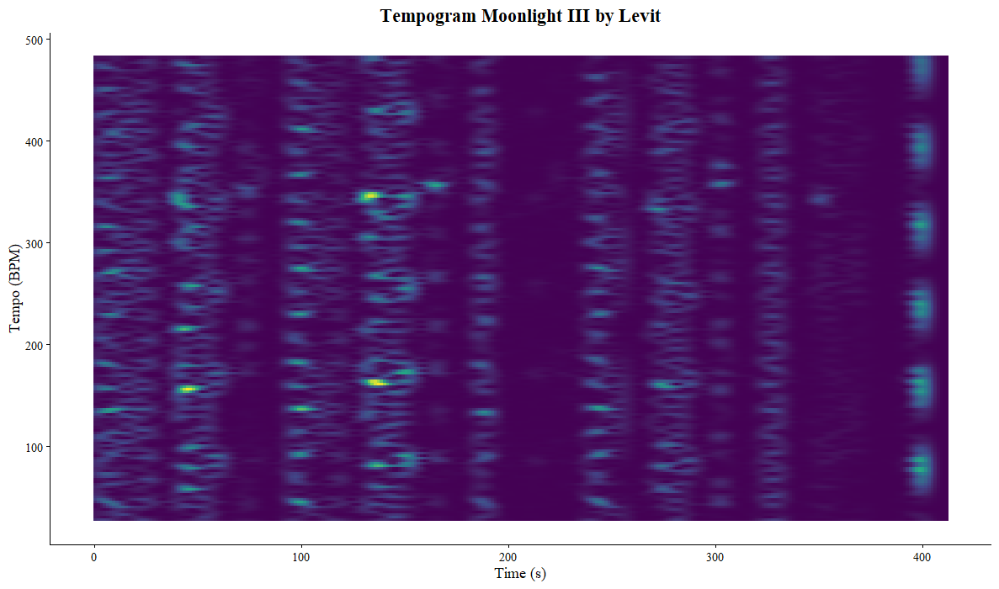 
*Tempogram of the Moonlight sonata (No. 14), 3rd movement, Perfomance by Levit. Fourier-based.*

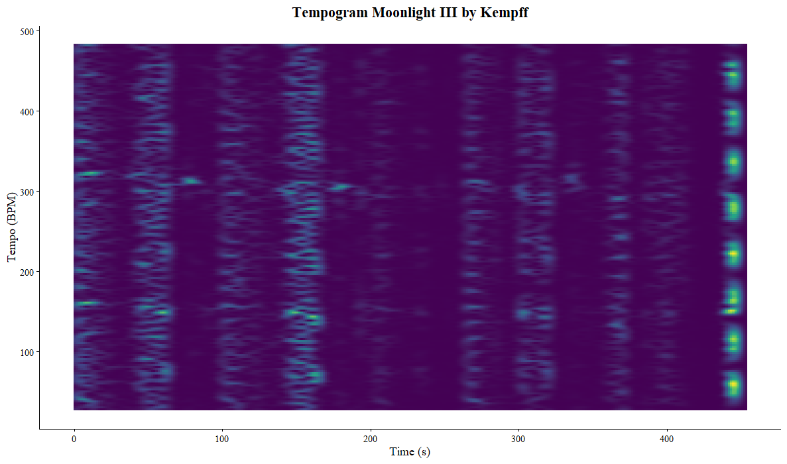 
*Tempogram of the Moonlight sonata (No. 14), 3rd movement, Perfomance by Kempff. Fourier-based.*

## Row {width="40%"}

```{r}
htmltools::HTML('

<strong>Tempogram</strong>

<p>On the right are tempograms: two depicting the second movement of the Waldstein sonata and the others depict the third movement of sonata Moonlight. The Waldstein sonata is performed by Say and the Moonlight sonata is performed by, respectively, Say, Levit and Kempff. I chose these two pieces because when listening to them they sound very contrasting in terms of tempo. Furthermore, I chose to compare the tempogram of the Moonlight sonata performed by Levit with the one performed  by Kempff because it sounds like Levit plays it faster, as already mentioned with the DTW.<br>

The second movement of the Waldstein sonata is a short <i>adagio</i> in 6/8 time that serves as introduction on the next movement. When listening to the piece, it is hard to figure out what the tempo is due to the many rests, especially at the beginning of the piece. This is also illustrated in the tempogram, which looks like it does not really know what the tempo is at any given moment. However, around 25 second some lines become visible, but these are faint and all over the place. This is also when there starts to be more activity in the piece, namely a wave like pattern of notes in the left hand (without rests). There is still ambiguity in the tempogram regarding the BPM. However, when looking at the autocorrelation based tempogram below it, there is a clear line at 150 seconds at just above 50 BPM, which roughly correspond to the tempo of that passage.<br>

The third movement of the Moonlight sonata is a very fast <i>presto agitato</i> in common time. There are three very faint horizontal lines or accents in the tempogram of the performance by Say, all at the level between 300 and 350 BPM, which roughly corresponds to the percieved tempo listening to the piece. These accents appear at around 50, 150 and 310 seconds, with align with moments where the perceived tempo is particularly easy to identify by ear and thus are also picked up in by tempogram. There are also vertical lines at around 100 and 200 seconds. It is difficult to determine where these come from when listening to the audio. These horizontal lines also appear at other moments in the tempogram.<br>

The tempogram for the <i>presto agitato</i> is more clear than the one for the <i>adagio</i>. However, the tempo does not immediately become apparent. This is likely due to the fast arpeggios in the piece.<br> Thus, although it is fairly simple to determine the tempo by ear, computing it proves difficult.<br>

As said before, it sounds like Levit plays the third movement of the Moonlight sonata much faster than Kempff. The two tempograms are, again, not very clear. However, a faint horizontal line or accent can be seen for both of them: a similar pattern as in the tempogram of the performance by Say (around 50 and 150 seconds for the tempogram of Levit\'s performance and a more distinguished line for the performance by Kempff). The accent for Levit\'s tempogram is around 350 BPM and for Kempffs tempogram around 310 BPM. Thus, it looks like Levit does indeed play this piece faster. Another interesting thing to note is that the horizontal accent in Kempff\'s tempogram (from 0 to 200 seconds) curves downwards. This suggests that he deviates from his initial starting tempo.
<p>

')
```

# Clustering

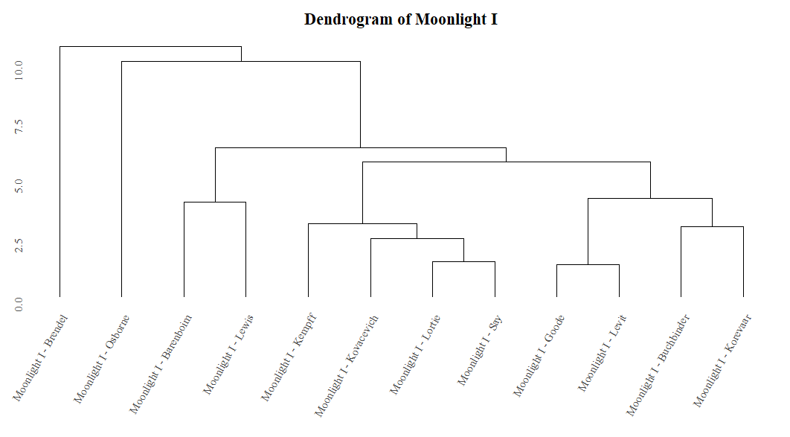 
*Dendrogram of performances of the Moonlight sonata (No. 14), 1st movement. Using the features energy, loudness, acousticness, valence and tempo. Distance: Manhattan, linkage: complete.*

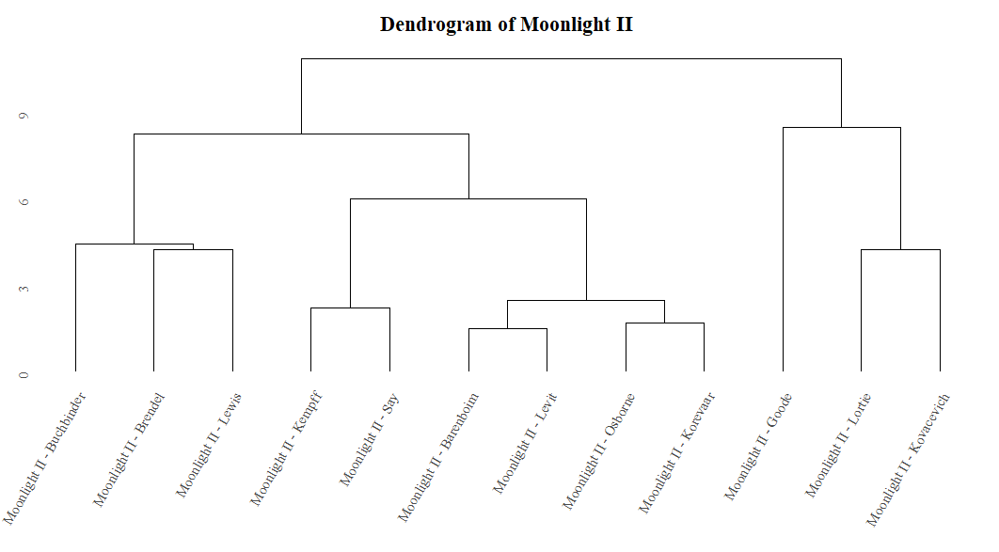 
*Dendrogram of performances of the Moonlight sonata (No. 14), 2nd movement. Using the features energy, loudness, acousticness, valence and tempo. Distance: Manhattan, linkage: complete.*

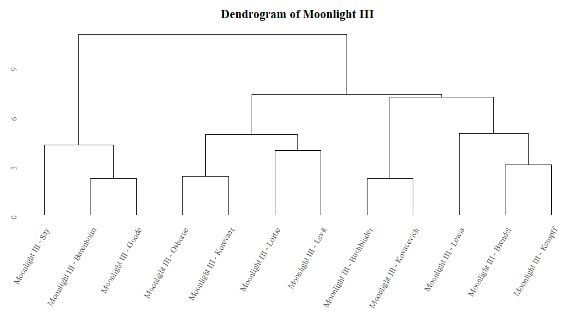 
*Dendrogram of performances of the Moonlight sonata (No. 14), 3rd movement. Using the features energy, loudness, acousticness, valence and tempo. Distance: Manhattan, linkage: complete.*

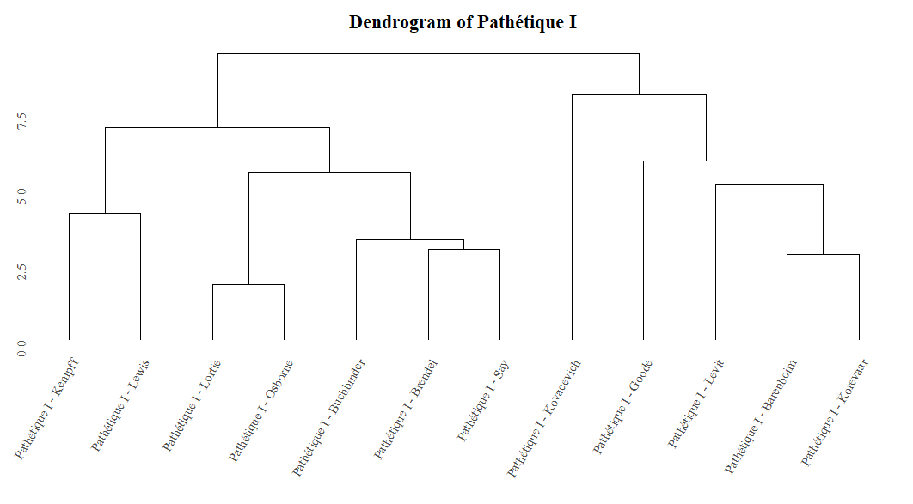 
*Dendrogram of performances of the Pathétique sonata (No. 8), 1st movement. Using the features energy, loudness, acousticness, valence and tempo. Distance: Manhattan, linkage: complete.*

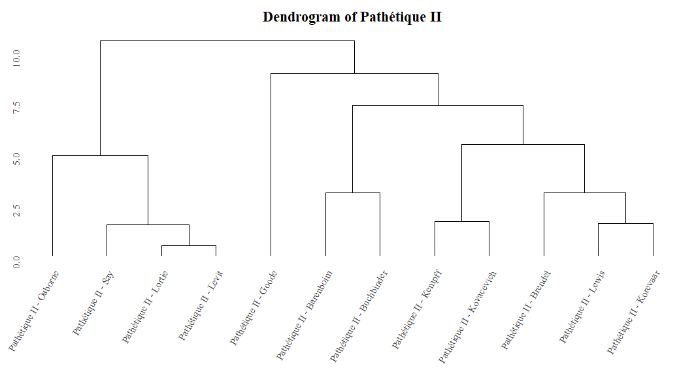

*Dendrogram of performances of the Pathétique sonata (No. 8), 2nd movement. Using the features energy, loudness, acousticness, valence and tempo. Distance: Manhattan, linkage: complete.*

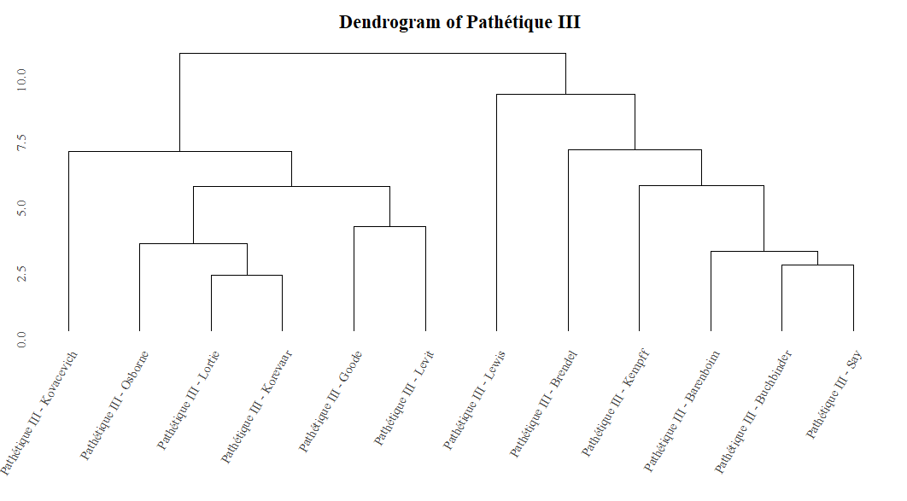

*Dendrogram of performances of the Pathétique Sonata (No. 8), 3rd movement. Using the features energy, loudness, acousticness, valence and tempo. Distance: Manhattan, linkage: complete.*

## Row {width="40%"}

```{r}
htmltools::HTML('

<strong>Clustering</strong>

To examine how different pianists interpret the three movements the Moonlight sonata, hierarchical clustering was applied to five Spotify audio features: energy, loudness, acousticness, valence, and tempo. The other features were dropped because they don\'t necessarily say anything about interpretation. The dendrograms were constructed for each movement using complete linkage and Manhattan distance.<br>

In the second and third movements, a two-cluster structure emerges at the highest level of the hierarchy, though the split is uneven. Remarkably, in the first movement Brendel stands entirely apart from the remaining eleven pianists, forming a cluster of one. This indicates an uniquely distinctive interpretation of this movement in particular. When listening to Brendel, the aspect that stands out the most is the loudness: his interpretation sounds rather loud in comparison to the rest. Due to this loudness, it gives the impression of being more determined, while the other interpretations sound more hesitant and gloomy. At the other side of the dendrogram, Buchbinder and Korevaar form a cluster. Listening to those reveals that they have a rather fast tempo, compared to the interpretations on the other side of the dendrogram, including Brendel.<br>

Osborne and Korevaar show notable consistency across movements II and III. In both these movements they appear close together. However, in movement I they are quite far apart. This is probably because the tempo in which they play the first movement differs: Korevaar plays it faster.<br>

So, which pianists resemble each other tends to change from movement to movement. This suggests that while pianists may have a general interpretive style, how similar they sound to a specific other pianist depends on the movement being played.<br>

Below the dendrograms of the Moonlight sonata are dendrograms of the Pathétique sonata. Again, the Spotify features energy, loudness, acousticness, valence, and tempo were used and the dendrograms were computed the same way as for the Moonlight sonata.<br>

For all the movements, a two-cluster structure emerges at the highest level of the hierarchy. The split is quite even for the first and third movement, but uneven for the second movement. Listening to the interpretations in the right cluster reveals that these are somewhat louder than the ones in the left cluster. In addition, Korevaars performance, which lies on the right side, differs in tempo in comparison to the rest of the interpretations (even Lewis\', who Korevaar shares a cluster with). There is also a lot of tempo deviation in Korevaars piece itself. This also became apparent when listening to his interpretation of the first movement of the Moonlight sonata. As seen before, in this dendrogram his performance positions on the right side aswell.<br>

Furthermore, Lortie and Osborne tend to cluster together in all movements. Listening to these performances reveals similarity in sound aswell. Moreover, in all movements (also in Moonlight), it varies which pianists stand out from the rest. For instance, in the first movement of Pathétique, Kovacevich clusters at a high distance and in the second movement this is true for Goode. This, again, suggests that no single pianist has a consistently unique or outlier interpretation across all sonatas and movements.<br>

')
```

# Conclusion

## Row {.card-fill-height}

```{r}
htmltools::HTML('

<strong>Conclusion</strong>

This analysis has shown that computational tools can capture meaningful differences between interpretations of Beethoven\'s piano sonatas. Although the grams based on chroma stay mostly the same between interpretations, they are still useful for structural analyses. For instance, they show modulations and the overall harmonic structure of a piece. The Spotify features and tempograms reveal different aspects of the performances. Something that became clear is that there is a considerate amount of difference between tempi. This became especially apparent in the tempograms of the third movement of the  Moonlight sonata, where Levit plays the piece noticeably faster than Kempff, and in the clustering, where tempo was one of the main reasons for difference between pianists. Another thing that became clear is that interpretive individuality is specific per piece and movement. No single pianist stands out consistently across all sonatas and movements. Instead, it varies per movement which pianist takes a more distinctive approach. For instance, in the first movement of Pathétique, Kovacevich clusters at a high distance from the rest, while in the second movement this is true for Goode. This suggests that pianists do not simply apply one consistent interpretive style across all pieces, but instead make specific choices in movements. This would be difficult to determine by ear alone, given the amount of recordings in the corpus.<br>

These findings could particularly be of interest to musicologists, maybe even more to classical performers, who want to study performance practice in a more systematic way. These computational tools offer a way to analyse a large number of recordings at once and patterns could therefore emerge that are otherwise hard to detect. Furthermore, for performers, it could be useful to see where their own interpretation falls relative to others. For example, whether they are closer to the mean or taking a more distinctive approach in a particular movement. In this way, computational tools offer a valuable addition to the traditional \'analog\' way of studying musical performances.

<p style="position: absolute; bottom: 8px; font-size: 15px; color: #888;">References: code for computation by dr. J.A. Burgoyne, audio files from Spotify, code refinement for dashboard layout by Claude.ai and help from experienced front-end developer.</p>

')
```